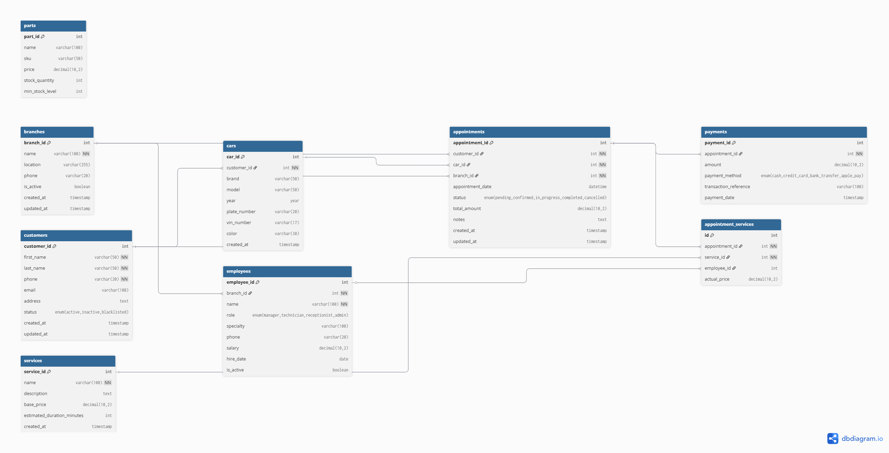
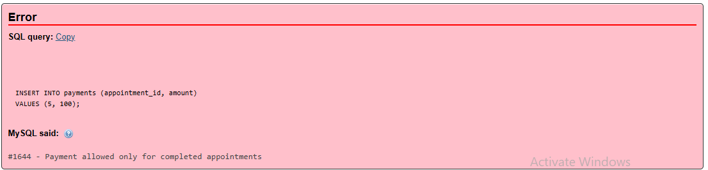
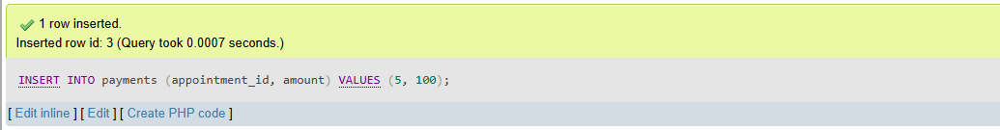

🚗 Enterprise Car Service Management System (ECS-MS)

High-Performance Relational Database Engine for Automotive Operations

📌 Executive Overview

The Enterprise Car Service Management System (ECS-MS) is a robust, scalable, and fully normalized relational database solution designed to streamline complex automotive service workflows. Built with ACID compliance at its core, the system manages the entire lifecycle of customer relations, vehicle diagnostics, service execution, and financial reconciliation.
This project demonstrates advanced database engineering principles, including automated business logic via triggers, optimized query performance through strategic indexing, and comprehensive data integrity constraints.

🏗️ System Architecture & Design Philosophy

The architecture follows a modular approach to ensure high cohesion and low coupling between business entities:
CRM Module: Advanced customer and multi-vehicle ownership tracking.
Operations Engine: Real-time appointment scheduling and service status lifecycle.
Financial Layer: Automated invoicing, multi-method payment processing, and transaction auditing.
Analytics Layer: Pre-computed views and optimized queries for Business Intelligence (BI) dashboards.

🗺️ Entity Relationship Diagram (ERD)

The system utilizes a sophisticated relational schema to handle complex many-to-many relationships (e.g., Service Orders to Catalog Services).

⚡ Advanced Database Engineering Features

1. Automated Business Logic (Triggers)
The system moves critical business rules to the database layer to ensure data consistency regardless of the frontend used.
A. Real-time Financial Calculation
This trigger ensures that the total_amount in the appointments table is always synchronized with the services added, eliminating manual calculation errors.

code
SQL

DELIMITER $$

CREATE TRIGGER trg_update_total_amount

AFTER INSERT ON appointment_services

FOR EACH ROW

BEGIN
    UPDATE appointments
    
    SET total_amount = total_amount + NEW.actual_price
    
    WHERE appointment_id = NEW.appointment_id;
    
END $$

DELIMITER ;

Verification:

Before Service Addition	After Service Addition

B. Strict Workflow Enforcement (Payment Validation)
To maintain financial integrity, the system prevents any payment entry unless the appointment status is explicitly set to 'completed'.
code
SQL
DELIMITER $$

CREATE TRIGGER trg_payment_validation
BEFORE INSERT ON payments
FOR EACH ROW
BEGIN
    DECLARE appt_status VARCHAR(50);
    
    SELECT status INTO appt_status 
    FROM appointments 
    WHERE appointment_id = NEW.appointment_id;

    IF appt_status != 'completed' THEN
        SIGNAL SQLSTATE '45000'
        SET MESSAGE_TEXT = 'Payment allowed only for completed appointments';
    END IF;
END $$

DELIMITER ;

Verification:

❌ Blocked (Invalid Status)	✅ Successful (Completed Status)

2. High-Performance Indexing Strategy
To support enterprise-level data volumes, the schema includes:
B-Tree Indexes on high-cardinality columns (Phone, Email, Plate Number).
Composite Indexes for optimized multi-column filtering in dashboard queries.
Foreign Key Optimization to ensure rapid JOIN operations across the core tables.

4. Encapsulated Business Logic (Stored Procedures)
Complex operations are abstracted into reusable procedures to reduce network latency and enhance security:
sp_CreateAppointment: Atomic transaction handling for new bookings.
sp_ProcessPayment: Secure payment handling with status synchronization.
sp_GetBranchPerformance: Aggregated analytics for management reporting.

📊 Business Intelligence & Analytics

The system includes 10+ Production-Grade SQL Queries designed for executive dashboards, providing insights into:
Revenue Metrics: Monthly Recurring Revenue (MRR) and Average Order Value (AOV).
Operational Efficiency: Service turnaround time and technician workload.
Customer Retention: Frequency of visits and vehicle health trends.
Financial Health: Payment method distribution and outstanding receivables.

🛡️ Security & Data Integrity

Referential Integrity: Strict FOREIGN KEY constraints with ON DELETE RESTRICT to prevent accidental data loss.
Data Validation: CHECK constraints and Trigger-based validation to ensure "Clean Data" entry.
View-Based Security: v_customer_cars and other views to abstract sensitive underlying table structures.

🚀 Roadmap & Future Scalability

RBAC Implementation: Role-Based Access Control at the database level.
Partitioning: Horizontal partitioning for the Payments table to handle millions of records.
API Integration: RESTful wrapper using Node.js/Sequelize or Python/FastAPI.
Event Scheduler: Automated database maintenance and daily summary reports.

👨‍💻 Technical Contribution

This project serves as a blueprint for developers looking to implement a professional-grade backend for:
 Automotive ERP Systems
 
 Workshop Management Platforms
 
SaaS Service Solutions
